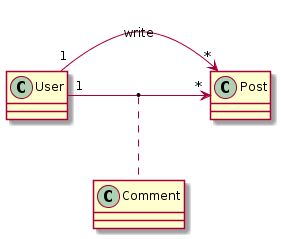
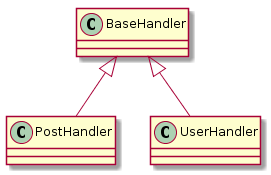

**Table of Contents**  

- [Concept](#concept)
  - [Project structure](#project-structure)
  - [Implementation](#implementation)
    - [Database Layer](#database-layer)
    - [Service Layer](#service-layer)
      - [Get and Post](#get-and-post)
      - [User actions](#user-actions)
      - [Code-Examples with pseudo-code comments](#code-examples-with-pseudo-code-comments)
      - [Security and Cookies](#security-and-cookies)
        - [Hashing](#hashing)
        - [Cookies](#cookies)
        - [Implementation](#implementation-1)
    - [View Layer](#view-layer)
      - [Template Engine](#template-engine)
  - [References](#references)

# Concept

## Project structure

- multi-user-blog/
    - handlers/
        - base_handler.py - containing webapp2 module
        - post_handler.py - responsible for post-related requests
        - user_handler.py - responsible for user-related requests
    - templates/
        - base.html       - our base.html which serves as a parent view
        - blog/           - subdir containing all blog-related html files
        - auth/           - subdir containing all blog-related html files
    - main.py             - containing all the url-mapping to handlers
    - models.py           - containing our User and Post class (db.Model)

## Implementation

### Database Layer



For creation of our models and relationships we use the [Python DB Client Library for Cloud Datastore](https://cloud.google.com/appengine/docs/python/datastore/api-overview)
Following that documentation we get following classes

```
class Post(db.Model,BaseHandler):

    title = db.StringProperty(required = True)
    content = db.TextProperty(required = True)
    author = db.ReferenceProperty(User, required = True, collection_name="posts")
    likes = db.IntegerProperty(required = False,default=0)
    liked_by_users = db.StringListProperty(required = True)
    created = db.DateTimeProperty(auto_now_add = True)
    last_modified = db.DateTimeProperty(auto_now = True)
    show_comments = db.BooleanProperty(default=False)

    ## getter-setter-methods

class User(db.Model, BaseHandler):
    name = db.StringProperty(required = True)
    pw_hash = db.StringProperty(required = True)
    email = db.StringProperty()

    ## getter-setter-methods

class Comment(db.Model):
    post = db.ReferenceProperty(Post, required = True, default=None, collection_name="comments")
    user = db.ReferenceProperty(User, required = True)
    content = db.StringProperty(required = True,multiline=True)

    ## getter-setter-methods
```


### Service Layer

BaseHandler is our parent module, which is responsible for handling the responses to the browser using jinja2.



#### Get and Post

Before we start, lets look at the difference between get and post:

1.  What is the difference between get and post?

    get: e.g. the client makes a get request when loading a page. The server(your app)
    knows the path and can creates a respone (e.g. a welcome page). There is NO
    data changed on server side, no database updates

    post: e.g. the client fills out a register form. Which means that there
    should be database queries and updates if the form is valid. Use post for that,
    because you don't want the clients data being shown in the url. And sometimes
    the browser makes random get requests, which would be not good when we try to save
    data with get requests.

2.  When to use self.request and self.response on application side?

    self.request is what the server request from the browser(client). This could be
    any data in the url or data inside the http header

    self.response what you would like to send to the browser(client). This could be
    an html form, data, text and so on. And inside the html for example you can then
    use the data to display it to the client with jinja2 or any other template engine.

#### User actions

Here you can see the user actions and the handlers that will be called on that action.

|URL, HANDLER           |POST/GET | ACTION |
|-----------------------|---------|--------|
|('/', BlogHandler)|GET|show all blog posts|
|('/register', RegisterHandler)|GET/POST|show register form or submit|
|('/login', LoginHandler)|GET/POST|show login form or submit|
|('/logout', LogoutHandler)|GET|logout the user|
|('/blog', BlogHandler)|GET|show all blog posts|
|('/blog/addpost', AddPostHandler)|GET/POST|show add post form and submit|
|('/blog/myposts', UserPostHandler)|GET|show all posts of user|
|('/blog/([0-9]+)', SinglePostHandler)|GET|show single post|
|('/blog/([0-9]+)/comments', PostCommentsHandler)|GET/POST|show all comments of post or submit|
|('/blog/([0-9]+)/edit', EditPostHandler)|GET/POST|show edit form of post or submit|
|('/blog/([0-9]+)/like', LikePostHandler)|POST|add like to post|
|('/blog/([0-9]+)/delete', DeletePostHandler)|POST|delete a post|
|('/blog/([0-9]+)/comment/([0-9]+)/edit', CommentEditHandler)|GET/POST|show edit form or submit|
|('/blog/([0-9]+)/comment/([0-9]+)/delete', CommentDeleteHandler)|POST|delete a comment|


#### Code-Examples with pseudo-code comments

This part shows us the implementation of 3 handlers in detail.
The **BlogHandler**, **AddPostHandler** and **SinglePostHandler**.

1. Implementing **show all blog posts** action

    |('/blog', BlogHandler)|GET|show all blog posts|
    |----------------------|---|-------------------|

    As we can see, this should be implemented as GET, because the user just requests the fetched data from the database. There is no data to changed on the database. When the user points the the url `/blog`, the `get()` method of BlogHander will be called. Below you can see the class with some pseude-code

    ```
    class BlogHandler(PostHandler):

        """ Responsible for forwarding the request coming from the "/blog" url """

        def get(self):

            """ Calls the method render_posts of the PostHandler class. """

            self.render_posts()
    ```

    The BlogHandler Class calls the `render_posts()` method of `PostHandler`.

    ```
    class PostHandler(BaseHandler):

        """ Responsible for rendering multiple and single posts and comments. """

        def render_posts(self, **params):

            """
                Creates a string of all rendered posts and uses render to show
                them on the blog page.
            """

            if params.has_key('user_posts'):
                posts = params['user_posts']
            else:
                posts = Post.get_all()

            rendered_posts = ""
            for post in posts:
                if params.has_key('comment'):
                    print "here"
                    rendered_posts += self.render_post(post,params['comment'])
                else:
                    rendered_posts += self.render_post(post)

            self.render("blog/blog.html", rendered_posts=rendered_posts)

        def render_post(self, post, comment_to_edit=None):

            """ Renders a single post as a string. """

            """
            TODO
            To keep the code more object-oriented I wanted to have the render_comments() method inside the PostCommentsHandler() class.
            But then I get following error:
            AttributeError: 'NoneType' object has no attribute 'cookies'.
            Thats why I put render_comments into this PostHandler Class.
            """
            #rendered_comments = PostCommentsHandler().render_comments()
            rendered_comments = self.render_comments(post=post, comment_to_edit=comment_to_edit)

            return self.render_str("blog/singlepost.html", p = post, comments=rendered_comments)

        def render_comments(self, post, comment_to_edit=None):

            """ Renders all comments of a single post. """

            rendered_comments = ""
            for comment in post.comments:
                if comment_to_edit and comment.get_id() == comment_to_edit.get_id():
                    rendered_comments += self.render_str("blog/editcomment.html", comment=comment_to_edit)
                else:
                    rendered_comments += self.render_str("blog/singlecomment.html", p=post, comment=comment)
            return rendered_comments
      ```

      We can see that `render_posts()` returns a string, which is build by
      calling other render-methods like `render_post()` and `render_comments()`


2. Implementing **show add post form and submit** action

    |('/blog/addpost', AddPostHandler)|GET/POST|show add post form and submit|
    |---------------------------------|--------|-----------------------------|

    Here we have to use cases. If the user clicks on **add post**, the `get()`
    method should be called, where a form is returned to the user. And if
    the user clicks then on submit, we want to call our `post()` method, which
    adds the post to the database.

    ```
    class AddPostHandler(BaseHandler):

        """ Responsible for adding a post to the database. """

        def get(self):
            """
            1.  if user exists, render "addpost.html"
            2.  else redirect to "/login"
            """
            if self.user:
                self.render("blog/addpost.html")
            else:
                self.redirect("/login")

        def post(self):
            """
            1.  get all the parameters from the request (form) and save them
                into variables
            2.  check if title and content exists, if not then put some error
                messages into a param list
            3.  if there is an error, render "addpost.html" with the errors inside
                the param list. else add the post to the database and redirect
                to page showing the single post with the url "/blog/{{\post_id}}"
            """
            post_title = self.request.get("post_title")
            post_content = self.request.get("post_content")
            param_list = dict(post_title=post_title, post_content=post_content)
            any_error = False

            if not post_title:
                param_list['title_error'] = "Title is missing!"
                any_error = True
            if not post_content:
                param_list['content_error'] = "Content is missing!"
                any_error = True

            if any_error:
                self.render("blog/addpost.html", **param_list)
            else:
                p = Post.add_post(post_title, post_content, self.user)
                self.redirect('/blog/%s' % str(p.key().id()))
    ```

    At the last line we see `self.redirect('/blog/%s' % str(p.key().id()))`,
    which will redirect us to the `/blog/([0-9]+)` url as shown in our
    user action table

    |('/blog/([0-9]+)', SinglePostHandler)|GET|show single post|
    |-------------------------------------|---|----------------|

    And the Implemention of SinglePostHandler is quite simple. It should render the given single_post:

    ```
    class SinglePostHandler(PostHandler):

        """ Responsible for rendering a single post. """

        def get(self, post_id):
            """
            1. get the post by id
            2. return a single post by rendering "permalink.html"
            """
            single_post = self.render_post(Post.by_id(int(post_id)))
            self.render("blog/permalink.html", single_post=single_post)
    ```

#### Security and Cookies

##### Hashing

1.  What is hashing?

    h(x) = y

    x is e.g. your original password. y is the output created by the hash algorithm.
    Its very difficult to get your original password x, when you only know y.
    So hashing is used for security reasons. But there is a problem.
    You can still use a brute force attack, hash the results and you will get the hashes.
    Or there is a big table called the rainbow table where a lot of hashes a already stored
    for common passwords and strings. So you can just take the password hash,
    search for it in the rainbow table and get the original password. A solution to that
    would be salt or other algorithms like bcrypt.

2.  What is salt?

    The salt is stored inside the database, next to the hashed password.
    A hacker retrieves the salt and password hash. Then he can recreate the
    original password, right? Why use salt then?

    Because the salt is unique for each user. So it is almost impossible
    to find the original text inside rainbow-tables, because of this unique salt.

- example one - table without salt

    |user  |password hash                                    |
    |------|-------------------------------------------------|
    |"dave"|"5abghd" (e.g original password "my_password123")|

    look for "5abghd" inside rainbow table and get password

- example two - table with salt  

    |user  |password hash                                                 |
    |------|--------------------------------------------------------------|
    |"dave"|"7dfjok","randomsalt" (e.g original password "my_password123")|

    look for "7dfjok" inside rainbow table and you will not be able to find
    the password because every user has his unique salt, so every hash is
    completely different and makes re-creation almost impossible

##### Cookies

1.  Why cookies?

    Cokies hand hold little piece of data. That way we don't always have to look up in the database if the user is logged in.
    We can store the data inside the browser and retrieve the information from the browser.

2.  What is the difference between "Cookie" and "Set-Cookie" in the Response or Request Header of the Browser?

    - *Set-Cookie*
      Is what the server sends to the browser in form of an HTTP Response. So the browser knows what to store.
      You can send multiple *Set-Cookie* (up to max 20) to the browser.

    - *Cookie*
      Is what the browser sends to the server in form of an HTTP Request. All the Cookies are stored inside the
      HTTP Request, seperated by a semicolon.


##### Implementation

Here are the relevant documented methods for our authentication system with cookies.
You will find these inside the base_handler.py module.

```
def login(self, user):
    """Creates a cookie for the browser.

    Args:
        user: the user who wants to log in
    """
    self.set_cookie('user_id', str(user.key().id()))

def logout(self):
    """Removes the cookie by adding an empty 'Set-Cookie' to the headers.
    """
    self.response.headers.add_header('Set-Cookie', 'user_id=; Path=/')

def set_cookie(self, name, value):
    """Creates a cookie, which will be added to the request header of the
    browser.

    Args:
        name: the name of the cookie
        value: the value of the cookie
    """
    secure_value = self.make_secure_value(SECRET, value)
    self.response.headers.add_header(
        'Set-Cookie',
        '%s=%s; Path=/' % (name, secure_value))

def get_cookie(self, name):
    """Get the cookie from the request by the browser and validate it.

    Returns:
        A string containing the cookie information, which was returned from
        the browser.
    """
    our_cookie = self.request.cookies.get(name)
    return our_cookie and self.check_secure_val(our_cookie)

def make_secure_value(self, secret_key, value):
    """Creates a secure value.

    Returns:
        A string containing the original value followed by a hashed version
        of that value.
    """
    return value + "|" + hmac.new(secret_key, value).hexdigest()

def check_secure_val(self, h):
    """Creates a secure value and compares it to the original.

    Returns:
        val: the original value
        None: nothing, if given hash is not equal to the secure value.
    """
    val = h.split('|')[0]

    if h == self.make_secure_value(SECRET, val):
        return val
    else:
        return None
```

### View Layer

#### Template Engine

To make our data available to the users, we use a template engine called jinja2.
That way it is a lot easier to map our data to the html files.

To see some documentation and examples go to [jinja2 documentation](http://jinja.pocoo.org/docs/2.9/)

In our case we just have a base.html file, which contains the header and the navigation.
The dynamic generated content will be places inside the content block:

```
<!DOCTYPE html>
<html>

<head>
    ...
</head>

<body>
    <div class="container">
        <div class="row">
            <div class="col-lg-4">
                <h1><a class="title" href="/blog">SonnenBlog!</a></h1>
            </div>
            <div class="col-lg-7">
                <nav>
                    ...
                </nav>
            </div>
        </div>
        <div class="row">
          <!-- HERE IS THE CONTENT BLOCK -->
          
          
        </div>
    </div>
</body>

</html>
```

## References

* http://www.agilemodeling.com/style/classDiagram.htm - UML examples
* http://jinja.pocoo.org/docs/2.9/ - Jinja2 Template Engine
